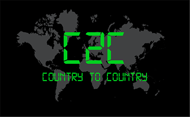

The Country to Country CTF (C2C) Cybersecurity Challenge is a series of international CTF competitions organized by the International Cyber Security – Center of Excellence (INCS-CoE) with leading international universities. The 2025 competition is hosted by the Northeastern University. 

C2C is an exciting opportunity for students to work together as international teams to solve interesting CTF challenges, learn new skills, socialize, and promote international collaboration and friendship. Interested university students across the US, UK, France, Israel, Japan and Australia participated in the qualifying competition on April 3, 2022. The final round of team competition will be held August 1, 2022 at 12:00 AM UTC.